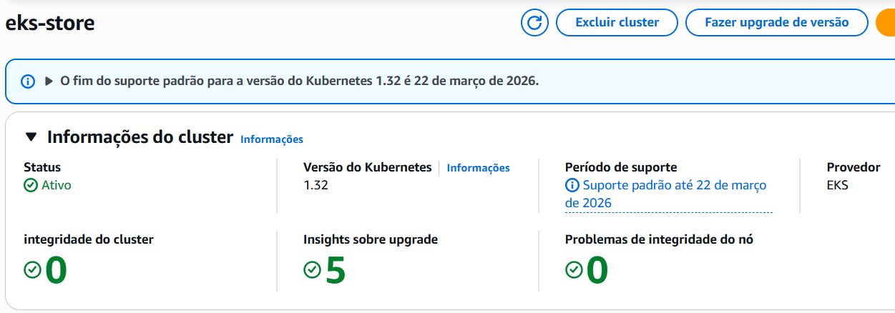
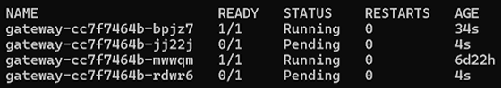
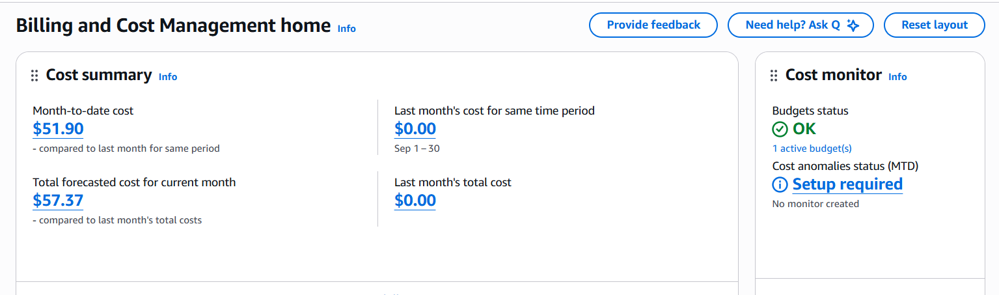
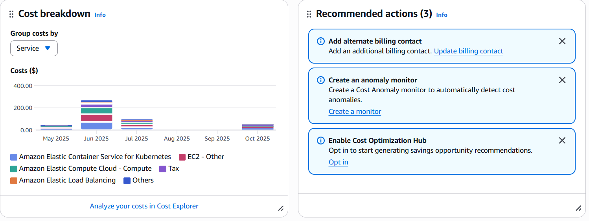

# **Projeto – AWS + EKS**

## ⚙️ Configuração da AWS CLI

Primeiro, instale o **AWS CLI** conforme a documentação oficial da Amazon:  
👉 [Guia de Instalação do AWS CLI](https://docs.aws.amazon.com/cli/latest/userguide/getting-started-install.html)

Após a instalação, configure suas credenciais executando o comando:

```bash
aws configure
```

Forneça as **chaves de acesso (Access Key ID e Secret Access Key)**, além da **região padrão** e do **formato de saída** desejado.

---

## ☁️ Criação do Cluster EKS

Com o AWS CLI configurado, prossiga com a criação do cluster **EKS (Elastic Kubernetes Service)**.

Exemplo de cluster em execução:  


Ao final do processo, será criado um cluster com duas subnets — **pública** e **privada** — conectadas por um **Load Balancer**.  
O tráfego externo chega pela subnet pública, onde o Load Balancer atua como intermediário, encaminhando as requisições para as aplicações hospedadas na subnet privada.  

Essa arquitetura garante **segurança e isolamento de rede**, pois o usuário externo não tem acesso direto às instâncias internas:  


Para conectar seu ambiente local ao cluster, execute o seguinte comando:

```bash
aws eks update-kubeconfig --name eks-store
```

Após isso, você poderá acessar e gerenciar o cluster remotamente por meio do `kubectl`.

---

## 🧪 Teste de Carga

Abaixo está um vídeo demonstrando o teste de carga realizado no cluster:

[](../video/teste_carga.mp4)

> 📌 Clique na imagem para assistir ao vídeo do teste de carga.

---

## 🚀 CI/CD – Integração e Entrega Contínuas

O pipeline de **CI/CD** deste projeto é orquestrado pelo **Jenkins**, garantindo que todas as atualizações sejam:
- **Continuamente integradas** ao repositório principal (CI)
- **Testadas e validadas automaticamente**
- **Entregues e/ou implantadas de forma automatizada** (CD)

### Principais responsabilidades do Jenkins
- Build e validação do código a cada commit
- Execução automática da suíte de testes
- Geração e versionamento de artefatos
- Build e push de imagens Docker para o registro configurado
- Deploy nos ambientes configurados (ex.: Kubernetes/EKS)

### Benefícios do pipeline
- Redução de falhas durante deploys
- Feedback rápido para desenvolvedores
- Maior padronização e rastreabilidade das versões
- Entregas mais rápidas e seguras

### 📚 Documentação Detalhada do Jenkins

A documentação completa do pipeline de CI/CD — incluindo arquitetura, fluxos dos jobs, ambientes, credenciais e logs de execução — pode ser acessada no link abaixo:

🔗 **Acessar Documentação Jenkins**
👉 [Documentação Jenkins](https://joao-pedro-queiroz.github.io/pma_apis_docs/jenkins/main/)

---

## 💰 Custos

A partir do painel **Billing and Cost Management** da AWS, é possível acompanhar detalhadamente os custos do ambiente em execução no EKS, incluindo EC2, balanceadores de carga e demais serviços associados.

---

### 🔹 Visão Geral dos Custos

A imagem abaixo mostra o **resumo dos custos mensais** até o momento, incluindo o custo acumulado no mês atual e a previsão total para o mês:



- **Month-to-date cost:** US$ 51.90  
- **Total forecasted cost:** US$ 57.37  
- **Último mês:** Sem custos registrados, indicando início recente de uso dos recursos.

---

### 🔹 Distribuição por Serviço

O gráfico abaixo mostra o **breakdown de custos** por serviço da AWS:



Principais serviços com custo associado:
- **Amazon Elastic Container Service for Kubernetes (EKS)** — custos do cluster e seus nós de controle.  
- **Amazon Elastic Compute Cloud (EC2)** — instâncias utilizadas pelos *worker nodes*.  
- **Amazon Elastic Load Balancing (ALB)** — balanceador de carga público responsável pelo tráfego externo.  
- **Impostos e outros serviços menores.**

---

### 🔹 Recomendações de Otimização

A AWS fornece recomendações automáticas de otimização de custo, como mostrado no painel:

- 💡 **Criar um monitor de anomalias de custo (Anomaly Monitor):** identifica aumentos inesperados no gasto.  
- 💡 **Habilitar o Cost Optimization Hub:** permite gerar relatórios de economia.  
- 💡 **Adicionar contatos de cobrança alternativos:** melhora a visibilidade e controle financeiro.

Essas ações ajudam a manter os custos previsíveis e evitar gastos indevidos.

---

### 🔹 Análise Detalhada

Para análises mais completas, é possível acessar o [**AWS Cost Explorer**](https://console.aws.amazon.com/cost-reports/home) e filtrar custos por:
- Serviço (EKS, EC2, etc.)  
- Região  
- Tag de projeto  
- Período mensal ou diário

---

📊 *Essas informações ajudam a manter o controle financeiro da infraestrutura em nuvem, permitindo identificar rapidamente aumentos de custo e otimizar os recursos utilizados no cluster EKS.*

---

## PaaS

